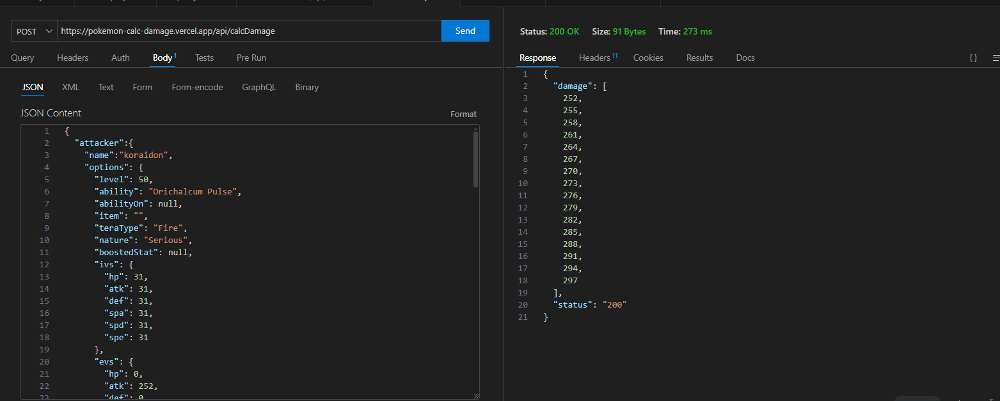

# Gen9ダメージ計算API
ShowDownのダメージ計算機能(https://github.com/smogon/damage-calc) を利用したダメージ計算APIです。
自作ツールへのShowDownダメージ計算機能の導入検討など試験用にご利用ください。

# 利用方法
下記API仕様に従い、POSTリクエストを送信してください。  
JSON形式で、ダメージ計算結果をレスポンスします。  
※ブラウザ上でダメージ計算をするツールではありません。  
レスポンス欄に記載しているように、CLIコマンドでの入力結果から、ダメージ計算をレスポンスするのみです。

# API仕様
## エンドポイント
- URL：https://pokemon-calc-damage.vercel.app/api/calcDamage
- メソッド：POST
## リクエスト
- ヘッダー：不要
- ボディ：以下のJSON形式  
　必須項目は以下3点です。それ以外はnullまたは項目自体削除しても問題ありません。
  - attacker > name
  - defender > name
  - move > name  
  デフォルトではレベル100となります。  "level":50はご記入下さい。

晴れ下A252コライドン(やけど状態)の炎テラスフレアドライブ > 耐久無振りハバタクカミへのダメージ計算
```json
{
  "attacker":{
    "name":"koraidon",
    "options": {
      "level": 50,
      "ability": "Orichalcum Pulse",
      "abilityOn": null,
      "item": "",
      "teraType": "Fire",
      "nature": "Serious",
      "boostedStat": null,
      "ivs": {
        "hp": 31,
        "atk": 31,
        "def": 31,
        "spa": 31,
        "spd": 31,
        "spe": 31
      },
      "evs": {
        "hp": 0,
        "atk": 252,
        "def": 0,
        "spa": 0,
        "spd": 0,
        "spe": 0
      },
      "boosts": {
        "hp": 0,
        "atk": 0,
        "def": 0,
        "spa": 0,
        "spd": 0,
        "spe": 0
      },
      "status":"brn"
    }
  },
  "defender":{
    "name":"fluttermane",
    "options": {
      "level": 50,
      "ability": null,
      "abilityOn": false,
      "item": "",
      "teraType": null,
      "nature": "Serious",
      "boostedStat": "spe",
      "ivs": {
        "hp": 31,
        "atk": 31,
        "def": 31,
        "spa": 31,
        "spd": 31,
        "spe": 31
      },
      "evs": {
        "hp": 0,
        "atk": 0,
        "def": 0,
        "spa": 0,
        "spd": 0,
        "spe": 0
      },
      "boosts": {
        "hp": 0,
        "atk": 0,
        "def": 0,
        "spa": 0,
        "spd": 0,
        "spe": 0
      },
      "status":null
    }
  },
  "move": {
    "name": "flareblitz",
    "options": {
      "isCrit": true,
      "isStellarFirstUse": false
    }
  },
  "field": {
    "weather": "Sun",
    "terrain": "Electric",
    "isMagicRoom": false,
    "isWonderRoom": false,
    "isGravity": false,
    "attackerSide": {
      "isTailwind": false,
      "isHelpingHand": false,
      "isBattery": false
    },
    "defenderSide": {
      "isReflect": false,
      "isLightScreen": false,
      "isFlowerGift": false,
      "isAuroraVeil": false
    }
  }
}
```
## レスポンス
JSON形式で最小~最大のダメージを配列で出力します。
```JSON
{
  "damage": [
    252,
    255,
    258,
    261,
    264,
    267,
    270,
    273,
    276,
    279,
    282,
    285,
    288,
    291,
    294,
    297
  ],
  "status": "200"
}
```


# 参考資料
入力に用いる値は下記に記載があります。(ポケモン名、アイテム名、タイプ名、フィールド名etc.)
https://github.com/pkmn/ps/tree/main/dex/data

# 今後の予定
- 日本語対応verのAPI作成
- ShowDownの導入手順整理

# その他
このAPIはVercelの無料枠を利用して公開しております。APIリクエスト頻度が多い場合は、公開を停止いたします。

# ライセンス
このパッケージは MIT ライセンスの条件の下で配布されています。
